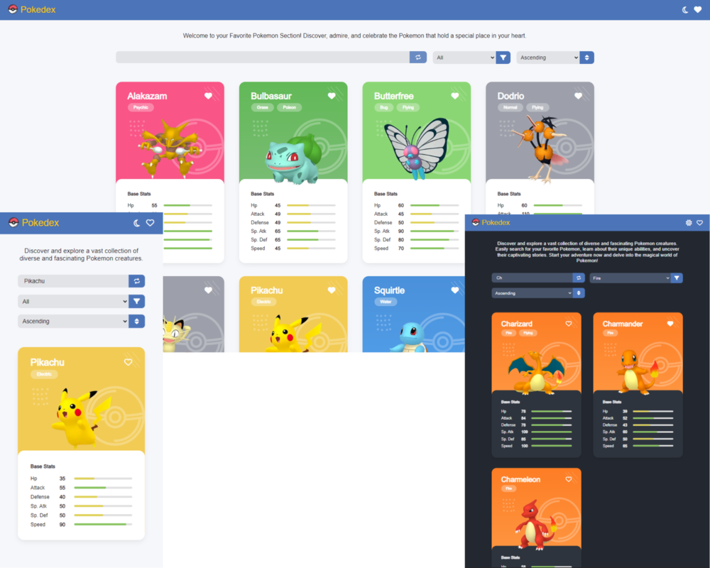

# Pokedex

This is a Pokemon catalog developed as part of the technical test for the Frontend Developer role at Platzi. The application uses the public Pokemon API to display detailed information about different Pokemon.

  

## Features

-  Server Side Render (SSR) with Next.js: Next.js was chosen for its focus on performance, ease of SSR configuration, and the SEO advantages it offers.
-  API Requests from the server: Initial data requests are made from the server to improve performance and efficiency.
-  Includes a search bar that allows users to search for Pokemon by name and instantly display the results.
-  Pokemon can be filtered and sorted by different attributes.
-  Users can add Pokemon to a favorites list for quick access to the Pokemon they are interested in.
-  Provides a button to switch between different appearance themes, including dark mode and light mode.
-  Custom styles: An attractive and visually pleasing design has been applied using SASS.
-  Responsive design: The website adapts and looks good on different devices and screen sizes.
-  The code is written in TypeScript to improve its quality and robustness.
-  Comprehensive testing has been included to ensure the quality and proper functioning of the application.

## Technologies Used

-  React
-  Next.js
-  TypeScript
-  Context API
-  Sass
-  Jest
-  Testing Library

## Installation and Execution Instructions

1. Clone this repository to your local machine.
2. Run `npm install` to install the dependencies.
3. Run `npm run dev` to start the development server.
4. Open your browser and access `http://localhost:3000` to see the application in action.

## Deployment

The Pokedex application has been deployed and is accessible at the following URL:

[Live Demo](https://main--rainbow-cucurucho-ab3d5a.netlify.app/)

You can visit the above URL to see the live version of the application and explore its features.

Please note that the deployment is hosted on Netlify, and the URL provided may change or become unavailable in the future.
